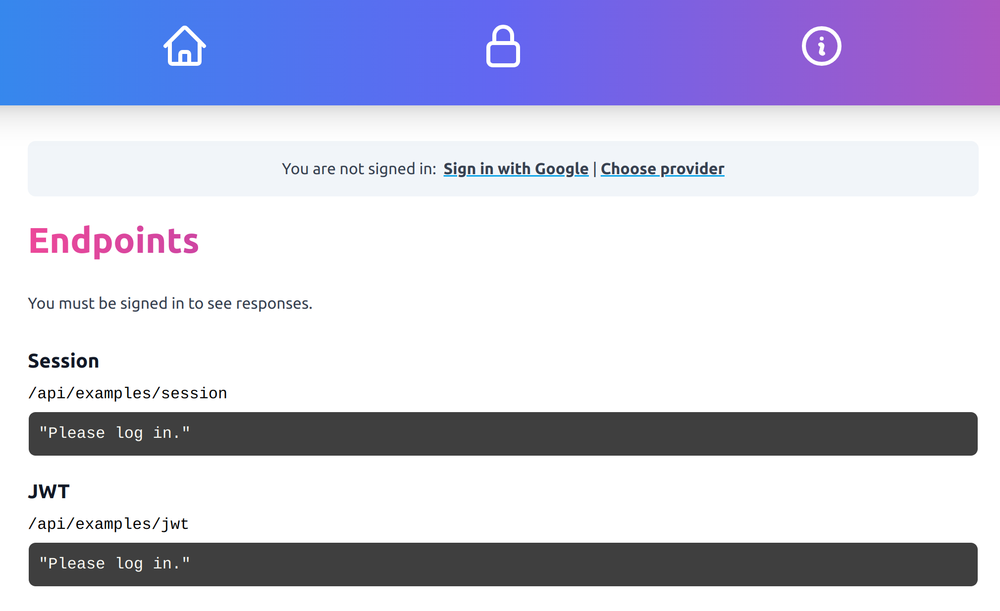

## The NextAuth.js Practice Project

The purpose of this project was to practice the basics of NextAuth.js and build a simple Next.js app with an OIDC/OAuth 2 (with JWTs) login flow.



This app features:
- `Google` and `AWS Cognito` as identity providers
- Direct login via Google and a separate, custom identity provider selection screen
- A protected sample page that requires authentication and displays different content depending on authentication status
- An endpoint page showing the content of the session and JWT


## How to start

### Set up your local environment

Use the `.env.template` file as an example to create your own `.env` file. This is where you can add the required information for any providers you want to set up. Currently only Google is being used.

You will need a `clientId` and `clientSecret` for Google which you can get from the developer admin page at [https://console.cloud.google.com/](https://console.cloud.google.com/). You will need to get the same information from your AWS Cognito identity provider, however for AWS Cognito you also need the `issuer` (URL).

For each identity provider, you will need to set up `http://localhost:3000` as an authorised origin and `http://localhost:3000/api/auth/callback/{identity_provider_name}` as an allowed callback URL.

### Run the application

Run locally using:

```
npm run dev
```

Then navigate to [http://localhost:3000](http://localhost:3000).
